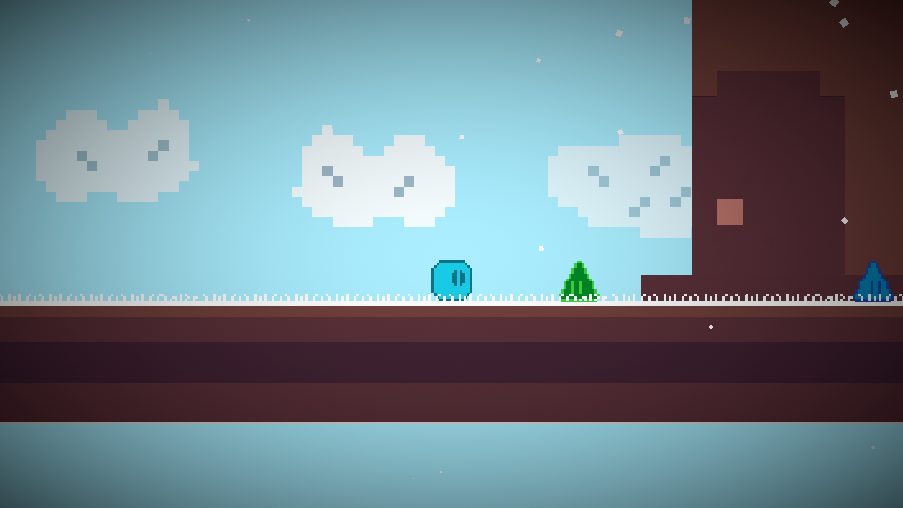
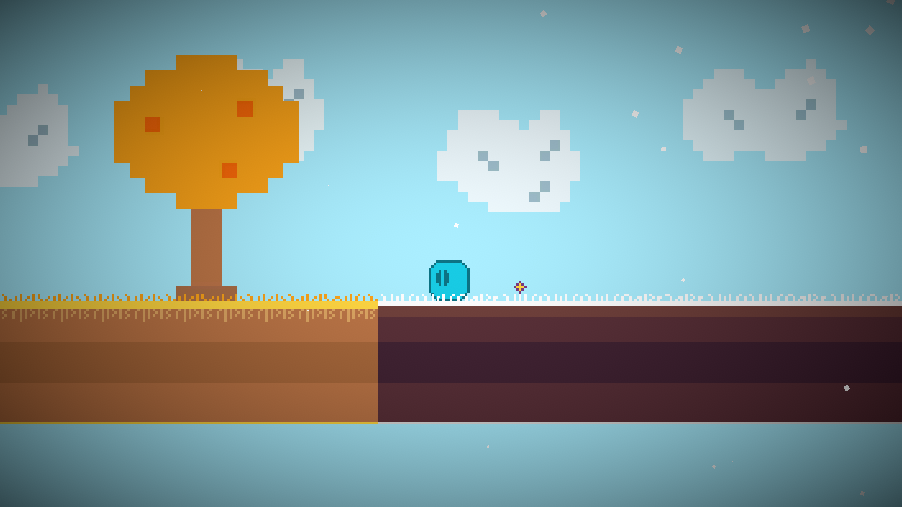

# The new zones + hiatus
Hello! After the release of ShapeWorld: FightLand, the development of the game has been pretty slow but here we are to show you the new zone: Winter.

# Winter... and Spring!?
So... the next update will be released with the last two zones: Winter and Spring, this is because the next update will be the last update for the story.

# Hiatus?
Okay... now I will speak as the main developer and not as "Pixel Barrels". The main reason for making this post its because I want to take a time of developing this game, this is because I don't feel the same motivation as before with ShapeWorld. Why? well, it's because I wrote the story and the gameplay so many years ago, now I'm not the same person and I don't like the story I've written, also, another reason for loosing the motivation on ShapeWorld is the numbers, even after all these years developing Origins, After Origins and FightLand, I can't even reach 100 downloads in each game, so I want to continue making games but using other genres. I hope you understand this, since I know that some people actually liked my games.

The only thing I want to say is that I will finish ShapeWorld sooner or later, I may do it in this year (2025) or in the next 5 years but I know I will finish this game.